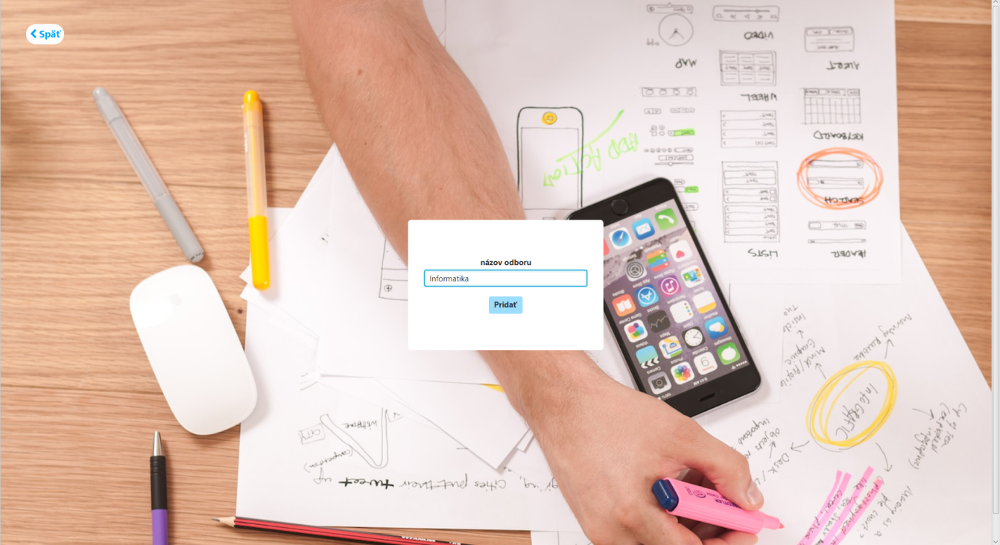
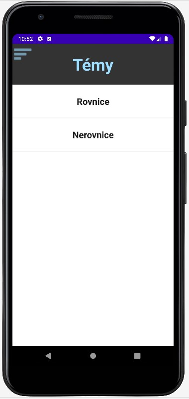
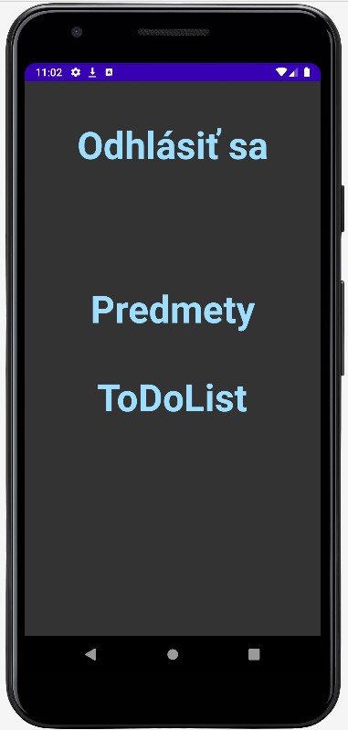
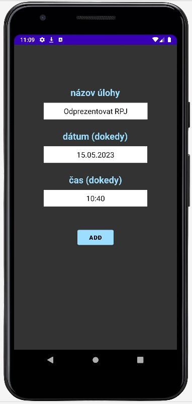

## *SYSTÉM NA SPRÁVU UČEBNÝCH MATERIÁLOV ŠKOLY*

***Podrobnejšiu dokumentáciu projektu je možné nájsť pod názvom "RPJ_dokumentacia_Hrabcak_Demcak_4SB.pdf" v priečinku "Dokumentacia".***

#### Anotácia

> Táto práca slúži ako centrálne úložisko materiálov pre študentov a učiteľov školy. Poskytuje priestor pre nahrávanie súborov, ich sťahovanie a mazanie. Taktiež tento systém vie spravovať tieto materiály a nastavovať prístup k materiálom podľa roly užívateľa.
>
> Systém pracuje s databázou, kde sa dá nahrať celá hierarchia školy, učitelia, študenti, triedy, predmety, materiály a pod. Za ich správu je zodpovedný školský administrátor s prislúchajúcimi prístupovými právami. Aplikácie sú užívateľsky prívetivé a intuitívne. Databáza je zdieľaná medzi všetkými podporovanými aplikáciami, je vytvorená v jazyku MySQL vo vývojovom prostredí MySQL Workbench a nahratá na XAMPP serveri pomocou webovej aplikácie pre správu databáz phpMyAdmin.
>
> Systém pozostáva z troch aplikácií (webová, desktopová a mobilná). Webová aplikácia je vytvorená pomocou HTML, CSS, JavaScript a PHP v aplikácii PhpStorm a poskytuje možnosť úplnej správy systému administrátorom. Spolu s desktopovou aplikáciou umožňuje prihlásenie sa učiteľov, ktorí môžu spravovať nimi vytvorené materiály pre študentov, ktorých učia a prihlásenie sa študentov, ktorí si tieto materiály vedia prezerať a sťahovať. Každý učiteľ a študent má prístupný svoj vlastný ToDoList, kde si môže zaznamenávať svoje povinnosti.
>
> Desktopová aplikácia je zakonštruovaná v jazyku Java pre Model a Controller a FXML pre View. Ponúka možnosť kompletnej správy školy.
>
> Nakoniec mobilná aplikácia, zostrojená vo vývojovom prostredí Android Studio, v jazyku Java pre Model a Controller a XML pre View, umožňuje prihlásenie sa študentom, prezeranie si vytvorených štruktúr ich učiteľmi a správu vlastného ToDoListu.

#### Databáza

- Základ projektu, úložisko dát
- Je zložená z 15 tabuliek, rozdelená do 4 sekcií:
	1. sekcia: Informácie o účtoch (login, heslo, typ účtu)
	2. sekcia: Administrátorský panel a všetky informácie o škole
	3. sekcia: Ukladanie informácií o témach, podtémach a súboroch
	4. sekcia: Zabezpečenie ukladania dát do ToDoListu

**Použité technológie:**
- MySQL
- MySQL Workbench

**Tabuľky databázy:**
- Účet
- Administrátor
- Učiteľ
- Študent
- Škola
- Odbor
- Ročník
- Trieda
- Skupina
- Predmet
- Učiteľ_Predmet_Trieda
- Téma
- Podtéma
- Súbory
- ToDoList

**ER diagram:**

#### Desktopová aplikácia

- Ponúka plnú správu školy pomocou administrátorského panela
- Prihlasovanie učiteľov a študentov
- Učitelia môžu vytvárať témy, podtémy a súbory pre žiakov, ktorí si ich po zverejnení môžu prezerať a sťahovať súbory
- Každý z týchto účtov má aj svoj ToDoList

**Použité technológie:**
- IntelliJ IDEA
- Architektúra MVC
- Java (Model a Controller)
- FXML (View) – Scene Builder

**Časti:**
- Prihlasovací panel
- Panely pre obnovu hesla
- Panel pre školského administrátora
- Učiteľský panel
- Študentský panel

**Súborova štruktúra:**

**Prihlasovací panel:**

**Panely pre obnovu hesla:**

**Panely pre obnovu hesla - video:**

**Administrátorský panel:**

**Administrátorský panel - všetky karty - video:**

**Administrátorský panel - pridávanie učiteľa a študenta + odosielanie informačného emailu - video:**

**Učiteľský panel:**

**Učiteľský panel - video:**

**Študentský panel:**

**Študentský panel - video:**

#### Mobilná aplikácia

- Len pre študentov
- MVC architektúra
- Android Studio
- Java (Model a Controller)
- XML (View)
- Študenti si môžu prezerať témy, podtémy a sťahovať súbory, ktoré im zverejní učieľ
- ToDoList

**Časti:**
- Prihlasovací panel
- Panely pre obnovu hesla
- Študentský panel

**Súborová štruktúra:**

**Prihlasovací panel:**

**Panely pre obnovu hesla:**

**Študentský panel:**

**Karta "Menu":**

**Karta "ToDo List":**

**Mobilná aplikácia - video:**

#### Webová aplikácia

- Kompletná administrácia celého systému
- Administrátor systému vie pridávať a spravovať školy
- Školský administrátor vie spravovať svoju školu
- Učitelia vedia pridávať, mazať a zdieľať učebné materiály
- Študenti si môžu prezerať témy, podtémy a sťahovať súbory, ktoré im zverejní učiťeľ
- ToDoList

**Použité technológie:**
-  MVC architektúra
- PhpStorm
- PHP
- jQuery a AJAX

**Časti:**
- Prihlasovací panel
- Panely pre obnovu hesla
- Panel pre administrátora systému (pridanie školy, správa škôl)
- Panel pre školského administrátora
- Učiteľský panel
- Študentský panel

**Súborová štruktúra:**

**Prihlasovací panel:**

**Registrácia školy:**

**Panely pre obnovu hesla:**

**Administrátorský panel - pridanie školy:**

**Administrátorský panel - správa škôl:**

**Administrátorský panel - správa školy:**

**Administrátorský panel školy:**

**Učiteľský panel:**

**Študentský panel:**

**Koniec ...**
